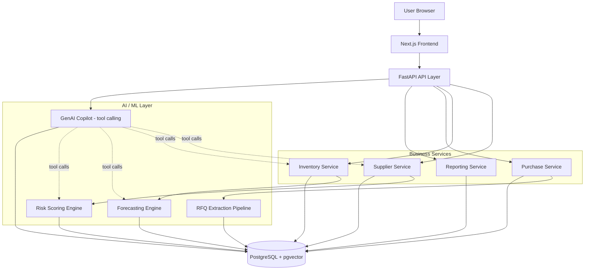

# Architecture

## Notes on key decisions

- **pgvector instead of a separate vector DB** — the copilot's RAG layer reuses
  the same Postgres instance (`doc_embeddings` table) instead of adding Pinecone/Weaviate,
  keeping the infra story simple for a single deployed instance.
- **Copilot is tool-calling, not freeform generation** — every copilot answer is
  logged with which internal API(s) it called (`copilot_logs.tools_called`), so
  answers are traceable to actual data rather than hallucinated.
- **Risk scoring is an explainable weighted scorecard**, not a black-box classifier —
  `risk_scores.factors` stores the component breakdown so the UI can show *why*
  a supplier is flagged, not just a number.
